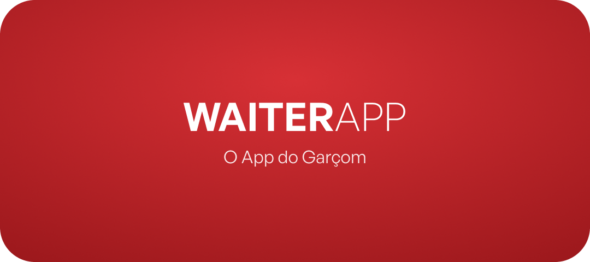
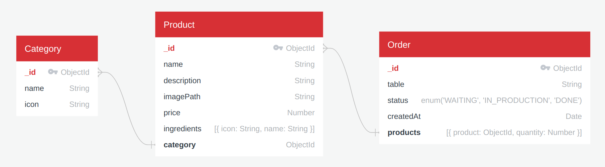
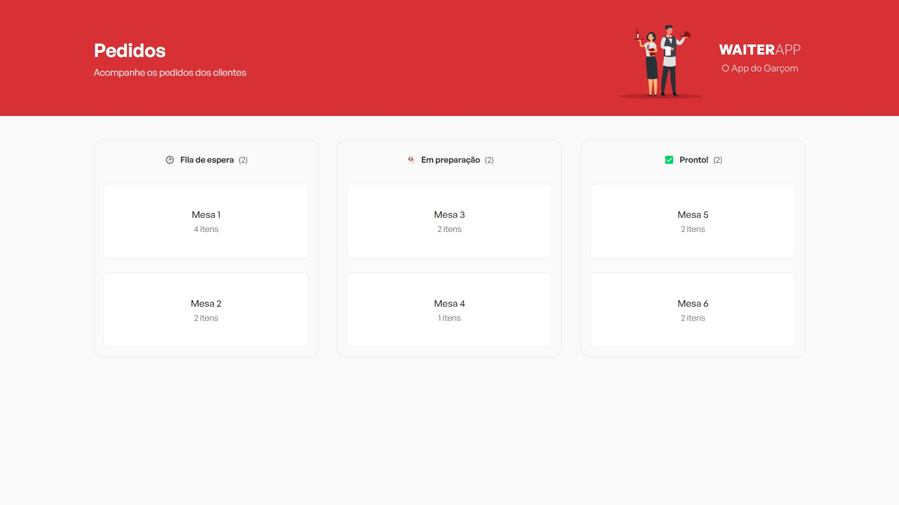
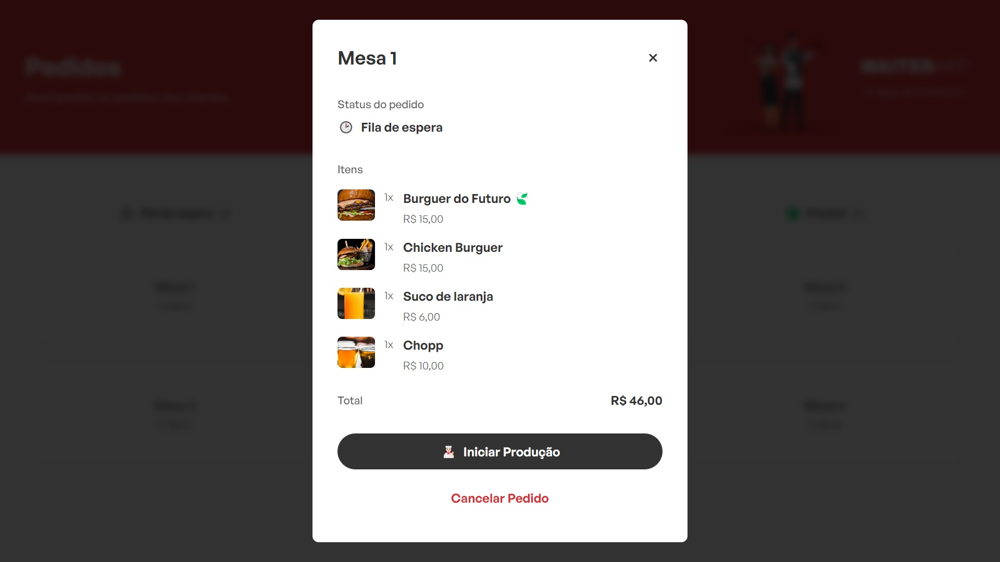
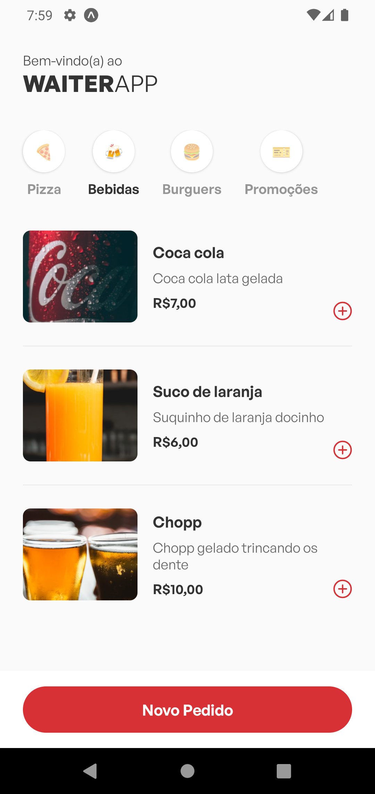
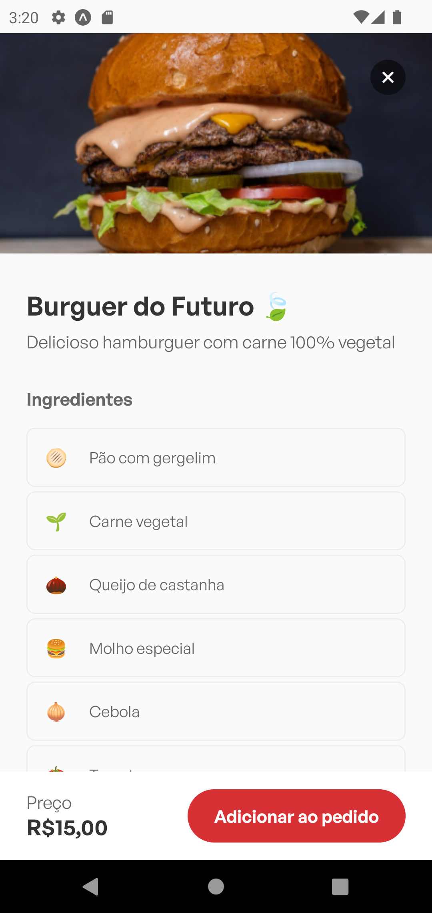
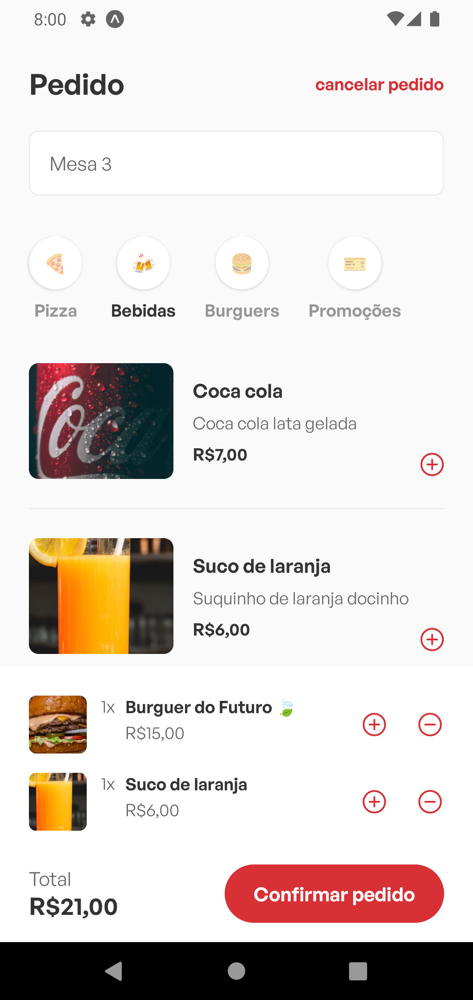

<p align="center">
  
</p>

<p align="center">
  <a href="https://www.linkedin.com/in/geisonpiegas/">
    
  </a>
  <a href="https://www.typescriptlang.org/">
    
  </a>
  <a href="https://nodejs.org/">
    
  </a>
  <a href="https://reactjs.org/">
    
  </a>
  <a href="https://reactnative.dev/">
    
  </a>
  <a href="https://www.mongodb.com/">
    
  </a>
  <a href="https://expo.dev/">
    
  </a>
</p>

<br />

# 👨‍🍳 Sobre

**WAITER**APP é um software de gerenciamento de pedidos para restaurantes!

Nele, garçons podem anotar pedidos pelo app e enviá-los para o dashboard web, em formato de kanban,
dividido em 3 colunas: 🕒 Fila de espera, 👨‍🍳 Em produção e ✅ Pronto!

O projeto foi desenvolvido inteiramente em Typescript durante o evento [O Poder do JS](https://opoderdojs.jstack.com.br/),
ministrado pelo [Mateus Silva](https://www.linkedin.com/in/mateusilva/).

O frontend web e mobile foram construídos usando React, React Native, Expo, Vite e Styled Components.
Já a api, usando Node.js, Express e MongoDB.

<br />

**Estrutura do banco de dados:**



<br />

# 🎨 Layout

Os layouts do app estão disponíveis no [**Figma**](https://www.figma.com/file/Ivct0qKlCFhWIIPrC5yHBF/WAITERAPP?node-id=216%3A1787&t=4ByEfZEfoA5QrxMn-0) 🎨

<p align="center">
  
</p>

<br />

## :computer: Resultado Aplicação WEB


<hr>

<hr>


<a id="-resultado-aplicação-mobile"></a>

## :iphone: Resultado Aplicação Mobile

<p align="center">
  
  
  
  
  
  
  
  
  
  
</p>


# 🤔 Como executar

Para clonar esse repositório pelo terminal, utilize o [Git](https://git-scm.com/).

```bash
# Clonando por HTTPS
git clone https://github.com/GeisonPiegas/waiter-app.git

# Clonando por SSH
git clone git@github.com:GeisonPiegas/waiter-app.git

# Entre na pasta do projeto
cd waiter-app
```

Para instalar as dependências e executar o projeto, é necessário possuir o [Node.js](https://nodejs.org/) instalado em sua máquina. Neste projeto, foi utilizada a versão LTS [18.12.0](https://nodejs.org/en/blog/release/v18.12.0/).

O app mobile pode ser visualizado através do [Expo](https://expo.dev/) em um dispositivo físico ou emulador (Android ou iOS).

Para executar o banco de dados MongoDB, foi utilizado um [Docker container](https://www.docker.com/resources/what-container/), mas existem outras alternativas como [MongoDB Atlas](https://www.mongodb.com/atlas/database) e [MongoDB Community](https://www.mongodb.com/try/download/community).

<table>
<tr>
<td align="center">Docker</td><td align="center">API</td>
</tr>
<tr>
<tr>
<td>

```bash
# Crie o container na porta padrão
docker run --name mongo -p 27017:27017 -d mongo

# Verifique se está ativo
docker ps -a
```

</td>
<td>

```bash
# Dependências da API back-end
cd api && npm install

# Execute a API
npm run dev
```

</td>
</tr>
<tr>
<td align="center">Web</td><td align="center">Mobile</td>
</tr>
<tr>
<td>

```bash
# Dependências do front-end web
cd web && npm install

# Execute o front-end web
npm run dev
```

</td>
<td>

```bash
# Dependências do app mobile
cd mobile && npm install

# Execute o app mobile (Expo)
npx expo start
```

</td>
</tr>
</table>

<br />

# 📝 License

Esse projeto está sob a licença MIT. Consulte [LICENSE](https://github.com/GeisonPiegas/waiter-app/blob/master/LICENSE) para mais informações.
